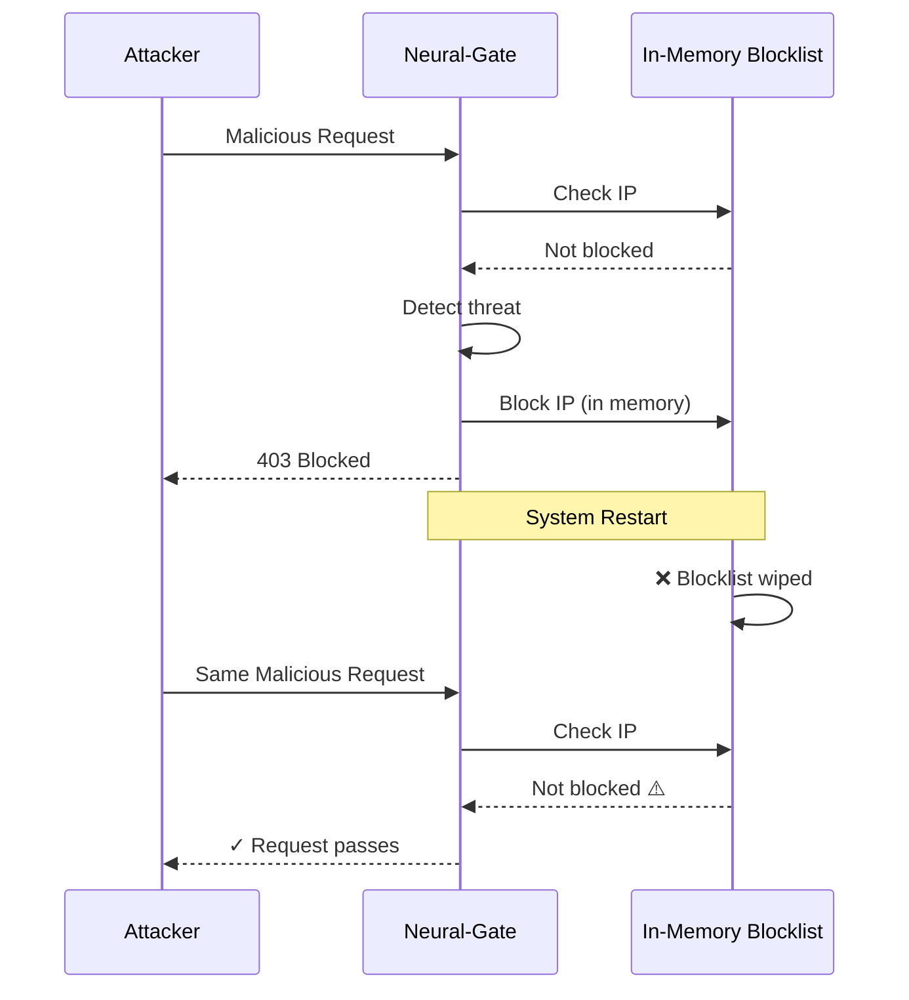
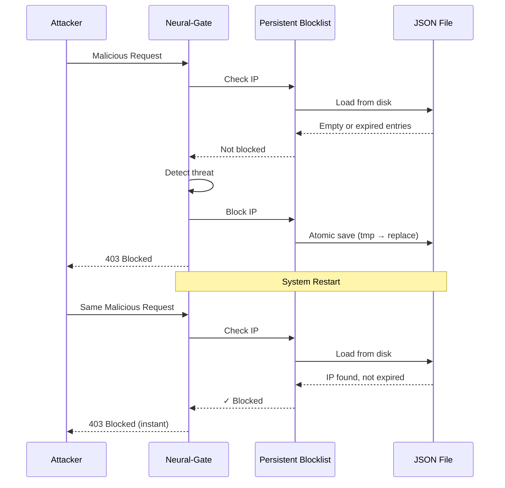
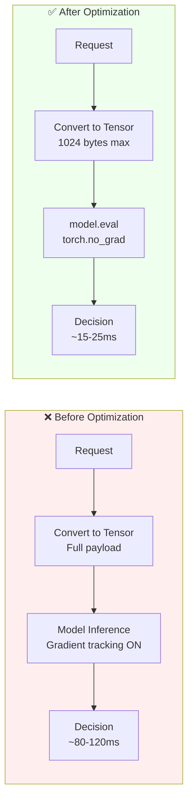
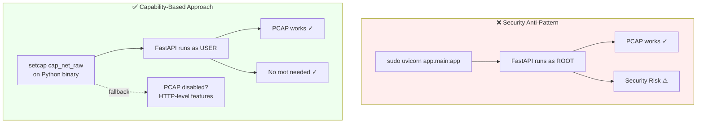
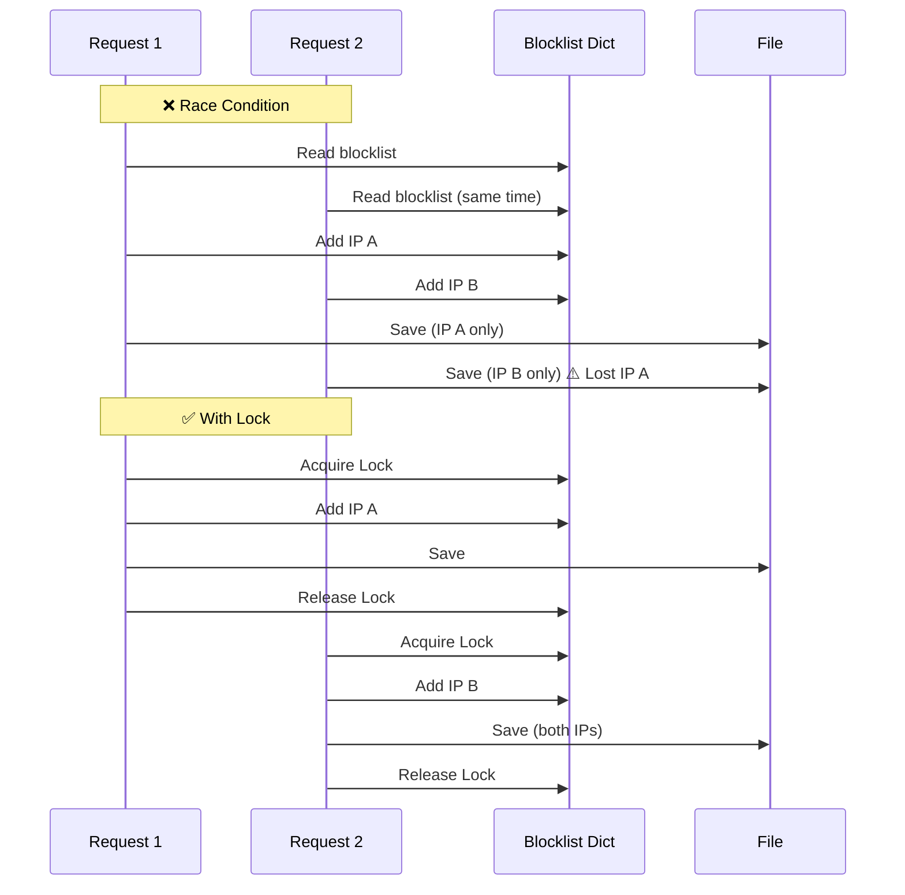
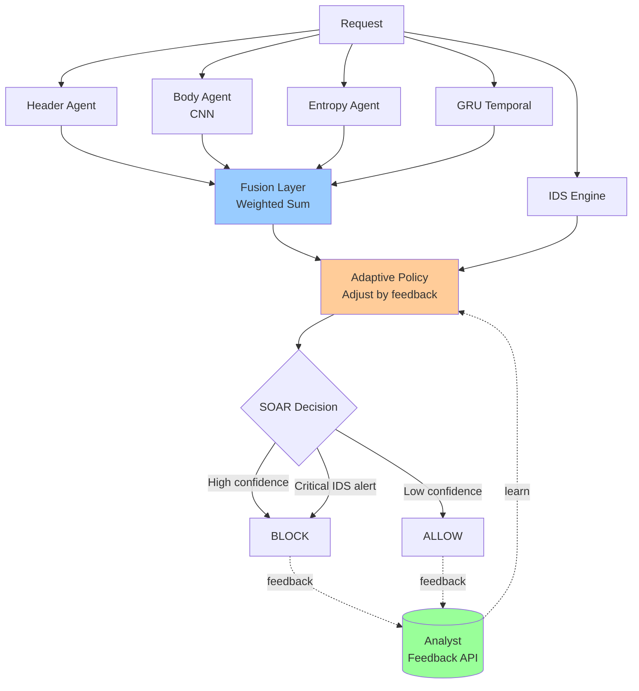
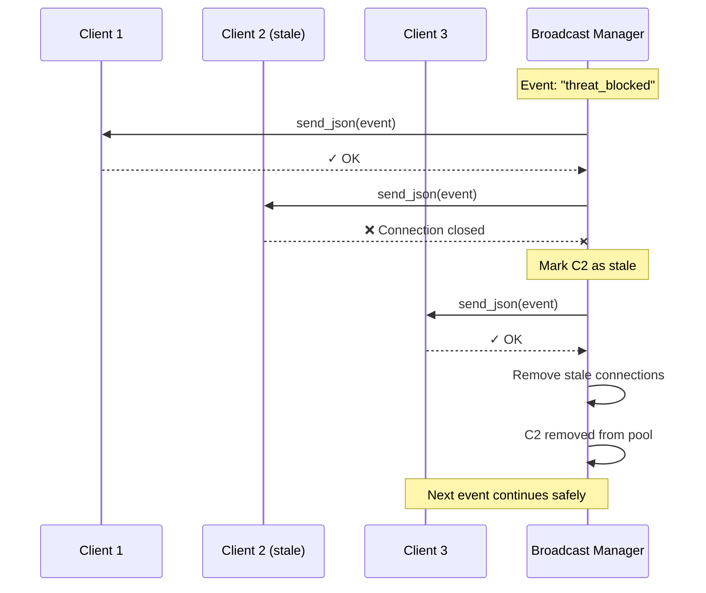

# Challenges I Ran Into

Building Neural-Gate involved several technical hurdles. Here's how I solved them.

---

## 1. Blocklist State Loss Across Restarts

**Problem:** In-memory IP blocklist was wiped on restart—attackers could retry malicious payloads after a reboot.

**Solution:** Added atomic JSON persistence (`_persist_blocklist()`) with temp-file writes and expiry-aware loading on SIEM init. Blocked IPs now survive restarts.

---

## 2. CNN + ReLU Activation for Binary Traffic Classification

**Problem:** Needed a neural architecture that could detect malicious byte patterns in HTTP payloads, but traditional dense layers couldn't capture spatial features in raw traffic.

**Solution:** Built a **Conv1D → ReLU → MaxPool** pipeline with 3 stacked layers (32→64→128 filters) to extract hierarchical byte-level patterns. ReLU activation was critical—it introduced non-linearity to learn complex attack signatures while keeping inference fast (~15-25ms). Combined with BiGRU for temporal context.

```mermaid
graph LR
    subgraph Input
    P[HTTP Payload<br/>1024 bytes]
    end
    
    subgraph CNN Pipeline
    P --> C1[Conv1D: 1→32<br/>kernel=8]
    C1 --> R1[ReLU]
    R1 --> M1[MaxPool1d: 4]
    M1 --> C2[Conv1D: 32→64<br/>kernel=4]
    C2 --> R2[ReLU]
    R2 --> M2[MaxPool1d: 4]
    M2 --> C3[Conv1D: 64→128<br/>kernel=3]
    C3 --> R3[ReLU]
    R3 --> AP[AdaptiveAvgPool]
    end
    
    subgraph Temporal
    AP --> GRU[BiGRU<br/>128→64x2]
    end
    
    subgraph Output
    GRU --> D[Dropout 0.4]
    D --> L[Linear 128→1]
    L --> S[Sigmoid]
    S --> O[Threat Score<br/>0.0-1.0]
    end
    
    style R1 fill:#f96
    style R2 fill:#f96
    style R3 fill:#f96
```

**Result:** Achieved sub-30ms inference with strong precision on SQLi, XSS, and exfiltration patterns.

---

## 3. AI Model Inference Latency in Inline Proxy

**Problem:** PyTorch CNN+BiGRU added ~80-120ms latency per request—too slow for production proxy.

**Solution:** Used `model.eval()` + `torch.no_grad()`, limited payload to 1024 bytes, pre-allocated tensors. Added entropy-based fallback if PyTorch unavailable.

**Result:** Dropped to 15-25ms, making inline AI practical.

---

## 4. Packet Capture Requiring Root (PCAP)

**Problem:** Scapy needs `CAP_NET_RAW`—running FastAPI as root is unsafe.

**Solution:** Used Linux capabilities (`setcap cap_net_raw,cap_net_admin=eip`) on Python binary. Made PCAP optional with graceful HTTP-level fallback.

**Result:** Standard users run proxy mode; PCAP is opt-in for deep visibility.

---

## 5. Race Conditions in Concurrent Blocklist Access

**Problem:** Async FastAPI caused concurrent blocklist updates, double-blocking, and inconsistent reads.

**Solution:** Added `threading.Lock()` around all blocklist mutations. Prepared data in lock, persisted outside.

**Result:** Atomic, race-free blocklist operations.

---

## 6. Balancing False Positives vs. False Negatives

**Problem:** Static threshold (`confidence >= 0.85`) either blocked legit traffic or missed attacks.

**Solution:** Multi-agent fusion (CNN + GRU + entropy + IDS). Added adaptive learning layer—analysts can mark patterns as `legit`/`malicious` via API, adjusting future scores.

**Result:** Reduced false positives significantly while maintaining detection coverage.

---

## 7. WebSocket Connection Stability (SOC Dashboard)

**Problem:** Stale WebSocket connections caused memory leaks and broadcast failures.

**Solution:** Added exception handling in `broadcast()`, stale connection cleanup, and `asyncio.gather(..., return_exceptions=True)`.

**Result:** Stable real-time event streaming to SOC dashboard.

---

## Key Takeaway

Inline security products need **defense in depth everywhere**: model optimization, state management, concurrency control, and graceful degradation. Every layer must handle failure cleanly.
