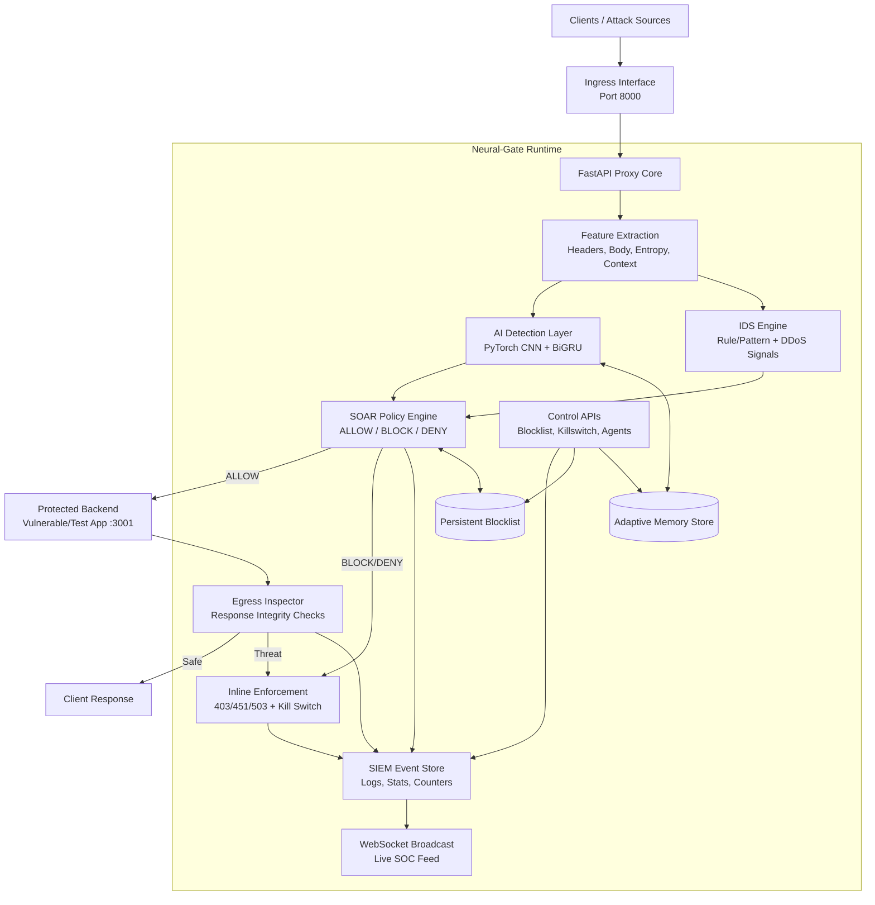
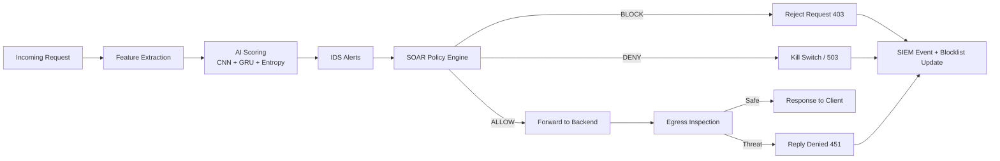
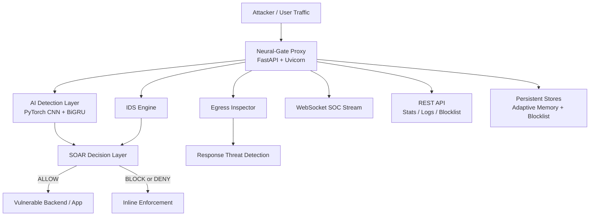
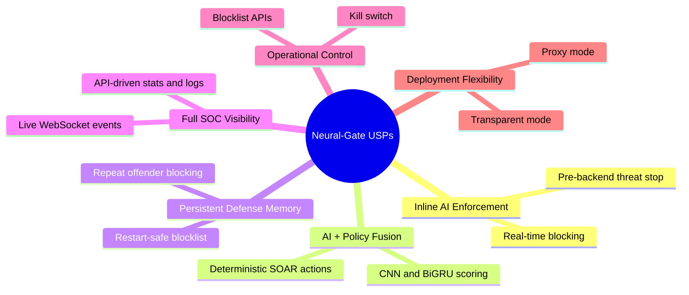

# Neural-Gate Product Positioning

Neural-Gate is a **real-time AI cyber defense gateway** that sits in front of applications, inspects traffic continuously, and takes autonomous response actions to stop threats before they impact core services.

It is not only a safety testing utility. It is a complete product that combines **detection, decisioning, enforcement, and SOC visibility** in one deployable platform.

## The Problem It Solves

Modern security operations are often fragmented: one tool for alerting, another for logs, another for blocking, and manual response across each stage. This creates response delays, blind spots, and inconsistent enforcement.

Neural-Gate solves this by unifying the traffic security loop so teams can:

- Detect malicious behavior early (ingress and egress)
- Block or deny risky traffic in-line before backend impact
- Persist defense state against repeat offenders
- Monitor all security events in a SOC-style live workflow
- Operate faster with fewer manual handoffs

## What People Can Use It For

- **Security training labs**: run realistic red-team/blue-team attack simulations
- **Detection engineering**: validate whether model and policy updates catch attacks
- **SOC onboarding and demos**: demonstrate end-to-end detect → decide → respond
- **Pre-production hardening**: stress-test protection behavior before production rollout
- **Research and experimentation**: tune thresholds, adaptive learning, and response policy

## How It Makes Existing Tasks Easier and Safer

- Replaces ad-hoc testing with a **repeatable attack-validation pipeline**
- Reduces accidental exposure by enforcing a **controlled proxy security path**
- Accelerates triage with **centralized event context** instead of scattered logs
- Improves confidence through **persistent blocking of repeat malicious sources**
- Enables operational control through kill switch and blocklist APIs

## USP (Unique Product Strengths)

- **Inline AI Enforcement**: moves from passive alerting to active prevention
- **AI + Policy Fusion**: combines learned risk scoring with deterministic SOAR policy
- **Persistent Defense Memory**: blocked sources remain enforced across restarts
- **Full Visibility Stack**: event stream, threat scores, stats, and blocklist in one system
- **Operational Controls**: kill switch, blocklist management, policy-driven response
- **Flexible Deployment Modes**: supports proxy and transparent topologies

## Core Technology Stack (Built Product)

- **Language and runtime**: Python
- **AI framework**: PyTorch
- **Neural model architecture**: `Conv1D + ReLU + MaxPool + Conv1D + ReLU + MaxPool + Conv1D + ReLU + BiGRU + Dropout + Sigmoid`
- **Temporal behavior agent**: GRU-based rolling anomaly scoring per source
- **Security control pipeline**: IDS + SOAR decision engine (`ALLOW / BLOCK / DENY`)
- **API and proxy layer**: FastAPI + Uvicorn + HTTPX
- **Live SOC telemetry**: WebSocket event broadcasting
- **Packet-level visibility**: Scapy / PyShark (Phase 2 PCAP capture path)
- **Adaptive memory and persistence**: persisted adaptive state + persisted blocklist enforcement

## Why It Matters for Organizations

Neural-Gate helps security and platform teams become **faster, safer, and more autonomous** by reducing response latency, improving attack containment, and converting security from passive monitoring into an active control layer.

In practical terms, it provides a unified **Detect → Decide → Enforce → Observe** product workflow instead of disconnected tools.

## Product Visuals

### System Architecture Diagram

### 1) Threat Decision Flow

### 2) Product Architecture

### 3) USP Map

